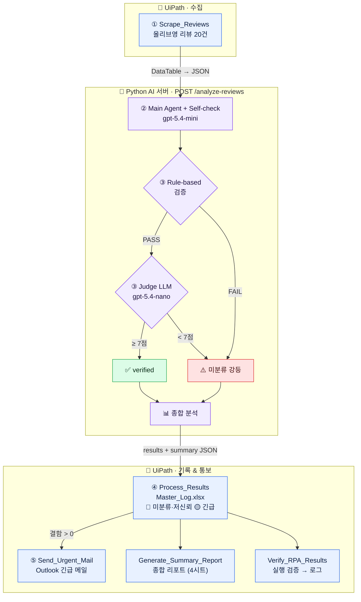

<div align="center">

# 🔍 리뷰 결함 분석 자동화 시스템

**올리브영 상품 리뷰를 수집·분석·검증하고, 제품 결함을 자동으로 담당 부서에 통보하는 RPA × AI 파이프라인**

`수집` → `AI 분석` → `이중 검증` → `엑셀 기록` → `긴급 메일`


</div>

---

## ✨ 핵심 차별점

> **"AI 분류기"가 아니라 "검증된 자동화 시스템".**
> AI 결과를 그냥 믿지 않고, **Rule-based → LLM-as-a-Judge → RPA 실행검증** 3계층으로 신뢰성을 보장한다.

| | 담당 | 역할 |
|:--:|:--|:--|
| 🤖 **RPA (손발)** | UiPath / Windows | 리뷰 수집 · 엑셀 기록 · 메일 발송 · 실행 결과 검증 |
| 🧠 **AI (두뇌)** | Python / FastAPI | 리뷰 분석 · 자체 검증 · 종합 분석 |

두 시스템은 **HTTP API** (`localhost:8000`)로만 통신한다.

---

## 🔄 워크플로우



---

## 🚀 빠른 시작 (Windows에서 클론 후)

> Mac에서 코드·xaml 골격은 완성. Windows에 남은 작업은 **① 셀렉터 캡처 · ⑤ Outlook 연결 · 실행**뿐이다.

### 0. 클론

```bash
git clone https://github.com/KoSeonJe/shopping-review.git
cd shopping-review
```

### 1. AI 서버 띄우기 · `Python 3.10+`

```bash
cd ai_server
python -m venv .venv && .venv\Scripts\activate     # Windows  (Mac: source .venv/bin/activate)
pip install -r requirements.txt
copy .env.example .env                             # Windows  (Mac: cp)
#  → .env 파일을 열어 OPENAI_API_KEY=sk-... 입력 (필수)
pytest                                              # mock 테스트 통과 확인
uvicorn main:app --reload                           # http://localhost:8000
```

✅ 브라우저에서 `http://localhost:8000/health` 가 `{"status":"ok"}` 면 성공.

<details>
<summary>서버 단독 동작 테스트 (curl)</summary>

```bash
curl -X POST localhost:8000/analyze-reviews \
  -H "Content-Type: application/json" \
  -d @tests/sample_20.json
```
실측: **정확도 90%**, `verification_pass_rate 0.95` (샘플 리뷰 20건 기준).
</details>

### 2. UiPath 설정 · `UiPath Studio · Windows 전용`

| 단계 | 작업 |
|:--:|:--|
| 1 | Studio에서 `rpa_workflow/project.json` 열기 → 의존 패키지 자동 복원 |
| 2 | `Scrape_Reviews.xaml` → **Data Scraping 마법사로 리뷰 텍스트·별점·작성일 Indicate** (placeholder 셀렉터 교체) |
| 3 | `Send_Urgent_Mail.xaml` → Outlook 계정 연결 확인 |
| 4 | `SetRangeColor`가 에러나면 설치 패키지의 **Set Range Color / Format Cells**로 교체 |

### 3. 실행 (End-to-End)

1. AI 서버가 켜져 있는지 확인 (1단계).
2. 올리브영 상품 페이지(예: **라운드랩 1025 독도 토너**) URL 복사.
3. `Main.xaml` 실행 → 인자 `in_GoodsUrl` 에 URL 붙여넣기.
4. 결과 확인:
   - 📄 `rpa_workflow/Data/Master_Log.xlsx` — 🔴/🟡 하이라이트
   - 📧 Outlook 긴급 메일 (제목 `[긴급]...`)
   - 📝 `rpa_workflow/Logs/execution_log.txt`

---

## 📁 디렉토리 구조

```
shopping-review/
├── ai_server/                  🧠 Python AI 서버 (FastAPI + OpenAI) — 검증 완료
│   ├── agent/                  core · tools · prompts · validators · judge · aggregator · pipeline
│   ├── data/                   department_map.json · ground_truth.json
│   ├── tests/                  sample_20.json · test_* · evaluate_accuracy.py
│   ├── main.py · config.py · requirements.txt · .env.example
│
├── rpa_workflow/               🤖 UiPath 프로젝트 (Mac 골격 / Windows 실행)
│   ├── project.json            호환성 Windows · VB.NET · 인자 in_GoodsUrl
│   ├── Main.xaml               오케스트레이션
│   ├── Scrape_Reviews.xaml     ① 리뷰 수집
│   ├── Process_Results.xaml    ④ 엑셀 기록 + 하이라이트
│   ├── Send_Urgent_Mail.xaml   ⑤ 긴급 메일
│   ├── Generate_Summary_Report.xaml · Verify_RPA_Results.xaml
│   ├── Data/  (Master_Log.xlsx · Reports/)
│   └── Logs/  (execution_log.txt)
│
├── docs/                       📚 scraping_target · api_spec · demo_script · verification_strategy
└── PRD.md · tech-spec.md · implement.md
```

---

## 📊 진행 상태

| Phase | 내용 | 상태 |
|:--:|:--|:--:|
| **A** | AI 서버 (분석·Rule·Judge·종합) | ✅ 완료 · 실호출 검증 |
| **B** | 정답셋 · 정확도 스크립트 | ✅ 완료 *(라벨 사람 확정 필요)* |
| **C** | UiPath xaml 6종 | ✅ Mac 골격 *(Windows 셀렉터·실행 남음)* |
| **D** | 문서 (docs/) | ✅ 완료 |

### Mac → Windows 이전 매트릭스

| 작업 | Mac (지금) | Windows (나중) |
|:--|:--:|:--:|
| xaml 텍스트 · project.json | ✅ | — |
| 셀렉터 Indicate 캡처 | ❌ | ✅ |
| 워크플로 실행 / 디버그 | ❌ | ✅ *(Studio 전용)* |
| Outlook 실제 발송 | ❌ | ✅ |

> ⚠️ hand-author xaml은 Studio 스키마가 엄격해 일부 액티비티가 안 열릴 수 있다. 깨지면 해당 액티비티만 재배치하면 되고, 골격·인자·로직은 유효하다.

---

## 📖 문서

[PRD.md](PRD.md) · [tech-spec.md](tech-spec.md) · [implement.md](implement.md)
[scraping_target](docs/scraping_target.md) · [api_spec](docs/api_spec.md) · [demo_script](docs/demo_script.md) · [verification_strategy](docs/verification_strategy.md)
