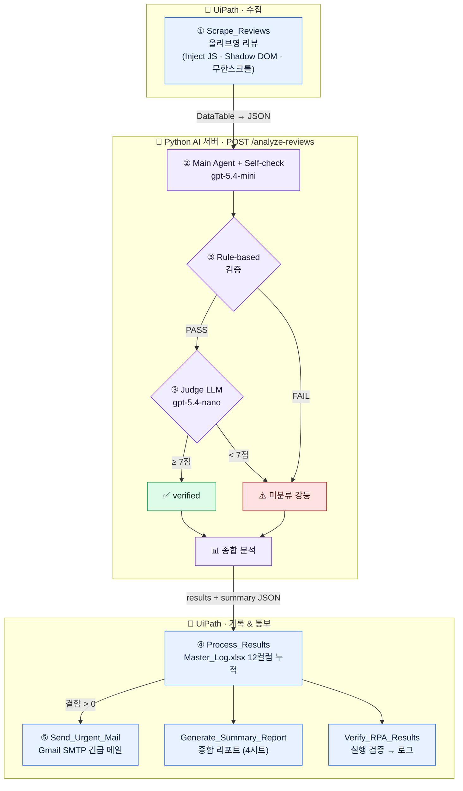

<div align="center">

# 🔍 리뷰 결함 분석 자동화 시스템

**올리브영 상품 리뷰를 수집·분석·검증하고, 제품 결함을 자동으로 담당 부서에 통보하는 RPA × AI 파이프라인**

`수집` → `AI 분석` → `이중 검증` → `엑셀 기록` → `긴급 메일`


</div>

---

## ✨ 핵심 차별점

> **"AI 분류기"가 아니라 "검증된 자동화 시스템".**
> AI 결과를 그냥 믿지 않고, **Rule-based → LLM-as-a-Judge → RPA 실행검증** 3계층으로 신뢰성을 보장한다.

| | 담당 | 역할 |
|:--:|:--|:--|
| 🤖 **RPA (손발)** | UiPath / Windows | 리뷰 수집 · 엑셀 기록 · 메일 발송 · 실행 결과 검증 |
| 🧠 **AI (두뇌)** | Python / FastAPI | 리뷰 분석 · 자체 검증 · 종합 분석 |

두 시스템은 **HTTP API** (`localhost:8000`)로만 통신한다.

---

## 🔄 워크플로우



---

## 🚀 빠른 시작 (Windows에서 클론 후)

> 스크래핑은 **Inject JS Script로 Shadow DOM·무한스크롤을 직접 처리**하므로 셀렉터 Indicate 캡처가 필요 없다(올리브영 상품이면 URL만 바꾸면 됨). 메일은 **Gmail SMTP**라 Outlook 설치도 불필요. 남은 건 **API 키·앱 비밀번호 입력 후 Studio에서 실행**뿐이다.

### 0. 클론

```bash
git clone https://github.com/KoSeonJe/shopping-review.git
cd shopping-review
```

### 1. AI 서버 띄우기 · `Python 3.10+`

```bash
cd ai_server
python -m venv .venv && .venv\Scripts\activate     # Windows  (Mac: source .venv/bin/activate)
pip install -r requirements.txt
copy .env.example .env                             # Windows  (Mac: cp)
#  → .env 파일을 열어 OPENAI_API_KEY=sk-... 입력 (필수)
pytest                                              # mock 테스트 통과 확인
uvicorn main:app --reload                           # http://localhost:8000
```

✅ 브라우저에서 `http://localhost:8000/health` 가 `{"status":"ok"}` 면 성공.

<details>
<summary>서버 단독 동작 테스트 (curl)</summary>

```bash
curl -X POST localhost:8000/analyze-reviews \
  -H "Content-Type: application/json" \
  -d @tests/sample_20.json
```
실측: **정확도 90%**, `verification_pass_rate 0.95` (샘플 리뷰 20건 기준).
</details>

### 2. 긴급 메일(Gmail SMTP) 설정 — 본인 메일로 받으려면

> 메일은 **제품결함(`제품결함`)이 1건 이상** 탐지될 때만 발송된다. 발송에는 **Gmail 앱 비밀번호**가 필요하다(일반 비밀번호 ❌).

1. **2단계 인증(2FA) 켜기** — [Google 계정 → 보안](https://myaccount.google.com/security) → "2단계 인증" 활성화 (앱 비밀번호의 전제 조건).
2. **앱 비밀번호 발급** — [Google 계정 → 앱 비밀번호](https://myaccount.google.com/apppasswords) → 이름 입력 후 생성 → **16자리**(예: `abcd efgh ijkl mnop`)를 복사. *표시는 4칸씩 띄어져 있어도 실제 사용은 **공백 제거한 16자**(`abcdefghijklmnop`).*
3. **환경변수 등록** — CMD/PowerShell에서 (이 값을 UiPath가 런타임에 읽음):
   ```bat
   setx GMAIL_APP_PASSWORD "abcdefghijklmnop"
   ```
4. **(선택) 기록용** — `ai_server/.env` 에도 `GMAIL_APP_PASSWORD=abcdefghijklmnop` 한 줄 추가 가능 (`.gitignore`로 커밋 차단됨).
5. **발신/수신 주소 바꾸려면** — `Send_Urgent_Mail.xaml` 의 `Send SMTP Mail` 활동에서:
   - `Email` = 발신(로그인) Gmail 주소, `To` = 수신 주소. *(기본값은 둘 다 `a01039261344@gmail.com` — 자기 자신에게 발송)*
   - 다른 Gmail로 보내려면 `Email`·`GMAIL_APP_PASSWORD`를 그 계정 것으로 맞추면 된다.
6. ⚠️ **환경변수는 프로세스 시작 시 읽힌다** → `setx` 후엔 **Studio를 껐다 다시 켜야** 새 값이 반영된다. (미설정 시 메일 단계는 경고 로그만 남기고 스킵 → 파이프라인은 정상 완주)

> 자격증명 점검: `python -c "import smtplib,ssl; s=smtplib.SMTP('smtp.gmail.com',587); s.starttls(context=ssl.create_default_context()); s.login('<your-gmail>','<app-pw-no-space>'); print('OK')"` 가 `OK` 면 SMTP 정상.

### 3. UiPath 설정 · `UiPath Studio · Windows 전용`

| 단계 | 작업 |
|:--:|:--|
| 1 | Studio에서 `rpa_workflow/project.json` 열기 → 의존 패키지 자동 복원 |
| 2 | (선택) 대상 상품 변경 → **아래 "대상 URL 바꾸기"** 참고 |
| 3 | 메일 받으려면 → **2단계(Gmail SMTP 설정)** 완료 + Studio 재시작 |

### 4. 대상 URL 바꾸기 — `in_GoodsUrl`

스크래퍼는 올리브영 공통 구조(`OY-REVIEW-*` Shadow DOM)를 쓰므로 **올리브영 상품이면 셀렉터 재캡처 없이 URL만 교체**하면 된다.

- **Studio에서 (권장)**: `Main.xaml` 열기 → 하단 **인수(Arguments) 패널** → `in_GoodsUrl` 의 **기본값(Default)** 칸에 상품 리뷰 URL 붙여넣기.
- **또는 파일**: `rpa_workflow/Main.xaml` 최상단의 `this:Main.in_GoodsUrl="…"` 값 수정.
- URL은 상품 상세 + `&tab=review` 형태 (예: `…/getGoodsDetail.do?goodsNo=AXXXXXXXXX&…&tab=review`).
- 한 번에 긁는 양은 `Scrape_Reviews.xaml` 의 `intMaxScrolls`(기본 100)로 조절 — 테스트 땐 `1~2`로 낮추면 ~10여 건만 빠르게 수집.

### 5. 실행 (End-to-End)

1. AI 서버가 켜져 있는지 확인 (1단계, `http://localhost:8000/health`).
2. (메일 받을 거면) 2단계 완료 후 **Studio 재시작**.
3. `Main.xaml` 에서 **F5(Run)** — 크롬이 떠서 리뷰 스크롤·수집 → AI 분석 → 기록 → (결함 시) 메일 → 리포트 → 검증.
4. 결과 확인:
   - 📄 `rpa_workflow/Data/Master_Log.xlsx` — 12컬럼 누적
   - 📊 `rpa_workflow/Data/Reports/종합_분석_리포트_*.xlsx`
   - 📧 **제품결함 탐지 시** `[긴급]…` Gmail 메일 도착
   - 📝 `rpa_workflow/Logs/execution_log.txt` — `[VERIFY] PASS`

---

## 📁 디렉토리 구조

```
shopping-review/
├── ai_server/                  🧠 Python AI 서버 (FastAPI + OpenAI) — 검증 완료
│   ├── agent/                  core · tools · prompts · validators · judge · aggregator · pipeline
│   ├── data/                   department_map.json · ground_truth.json
│   ├── tests/                  sample_20.json · test_* · evaluate_accuracy.py
│   ├── main.py · config.py · requirements.txt · .env.example
│
├── rpa_workflow/               🤖 UiPath 프로젝트 (Mac 골격 / Windows 실행)
│   ├── project.json            호환성 Windows · VB.NET · 인자 in_GoodsUrl
│   ├── Main.xaml               오케스트레이션 (HTTP POST 타임아웃 10분)
│   ├── Scrape_Reviews.xaml     ① 리뷰 수집 (Inject JS · 무한스크롤 루프)
│   ├── Scripts/                ① 주입 JS — extract_reviews · scroll_more · goto_reviews_top
│   ├── Process_Results.xaml    ④ 엑셀 기록 (헤더 self-heal)
│   ├── Send_Urgent_Mail.xaml   ⑤ Gmail SMTP 긴급 메일
│   ├── Generate_Summary_Report.xaml · Verify_RPA_Results.xaml
│   ├── Data/  (Master_Log.xlsx · Reports/)
│   └── Logs/  (execution_log.txt)
│
├── docs/                       📚 scraping_target · api_spec · demo_script · verification_strategy
└── PRD.md · tech-spec.md · implement.md
```

---

## 📊 진행 상태

| Phase | 내용 | 상태 |
|:--:|:--|:--:|
| **A** | AI 서버 (분석·Rule·Judge·종합) | ✅ 완료 · 실호출 검증 |
| **B** | 정답셋 · 정확도 스크립트 | ✅ 완료 *(라벨 사람 확정 필요)* |
| **C** | UiPath xaml 6종 | ✅ Mac 골격 *(Windows 셀렉터·실행 남음)* |
| **D** | 문서 (docs/) | ✅ 완료 |

### Mac → Windows 이전 매트릭스

| 작업 | Mac (지금) | Windows (나중) |
|:--|:--:|:--:|
| xaml 텍스트 · project.json | ✅ | — |
| 셀렉터 Indicate 캡처 | ❌ | ✅ |
| 워크플로 실행 / 디버그 | ❌ | ✅ *(Studio 전용)* |
| Outlook 실제 발송 | ❌ | ✅ |

> ⚠️ hand-author xaml은 Studio 스키마가 엄격해 일부 액티비티가 안 열릴 수 있다. 깨지면 해당 액티비티만 재배치하면 되고, 골격·인자·로직은 유효하다.

---

## 📖 문서

[PRD.md](PRD.md) · [tech-spec.md](tech-spec.md) · [implement.md](implement.md)
[scraping_target](docs/scraping_target.md) · [api_spec](docs/api_spec.md) · [demo_script](docs/demo_script.md) · [verification_strategy](docs/verification_strategy.md)
