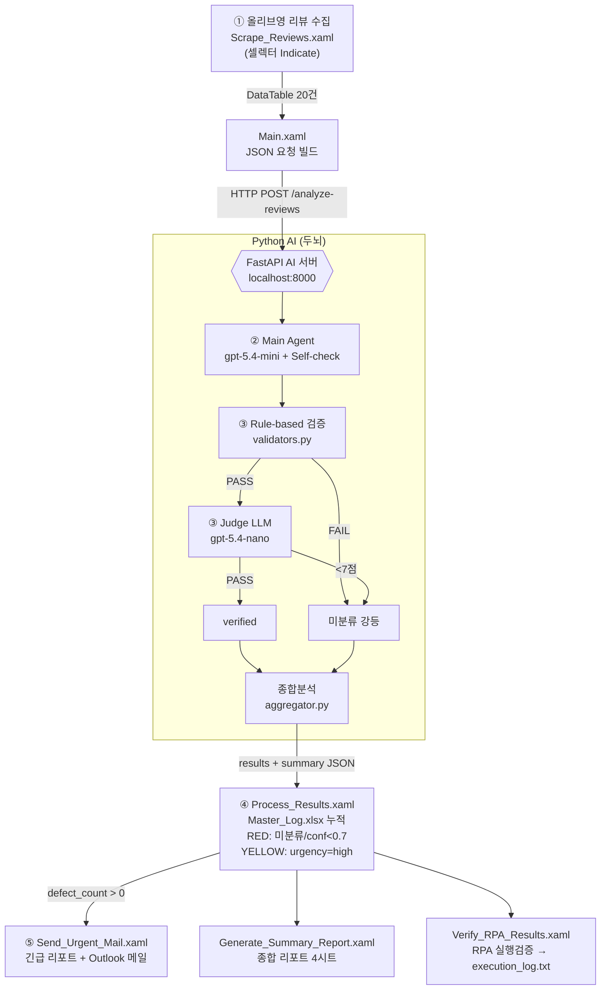

# 리뷰 결함 분석 자동화 시스템 (v2.0)

올리브영 상품 리뷰를 **수집 → AI 분석/검증 → 엑셀 기록 → 긴급 메일**까지 자동화. 14주차 발표용.

> 핵심 차별점: "AI 분류기"가 아니라 **검증된 자동화 시스템**. Rule-based + LLM-as-a-Judge + RPA 실행검증 3계층.

## 아키텍처 (역할 분담 — PRD §0.6 변경금지)

```
[UiPath / Windows]                         [Python / Mac·Windows 무관]
 Scrape_Reviews ──수집 20건──▶ HTTP POST ──▶ FastAPI /analyze-reviews
                                              ├ Main Agent (gpt-5.4-mini) + Self-check
                                              ├ Rule-based 검증 (validators.py)
                                              ├ Judge LLM (gpt-5.4-nano)
 Process_Results ◀──results+summary JSON──── └ 종합분석 (aggregator.py)
   ├ Master_Log.xlsx 누적 (12컬럼, RED/YELLOW)
   ├ defect>0 → Send_Urgent_Mail (Outlook "[긴급]...")
   ├ Generate_Summary_Report (4시트)
   └ Verify_RPA_Results → execution_log.txt
```

- **RPA(손발)** = 수집/엑셀/메일/결과검증 = UiPath
- **AI(두뇌)** = 분석/검증/종합 = Python
- 둘은 **HTTP API**로만 통신 (`localhost:8000`).

## 워크플로우



## 처음 세팅 (Windows clone 후)

> Mac서 골격까지 완료. Windows에선 ①셀렉터 캡처 + ⑤Outlook + 실행만 남음.

**0. 클론**
```bash
git clone https://github.com/KoSeonJe/shopping-review.git
cd shopping-review
```

**1. AI 서버 (Python 3.10+ 필요)**
```bash
cd ai_server
python -m venv .venv && .venv\Scripts\activate   # Windows
pip install -r requirements.txt
copy .env.example .env                            # Windows (Mac: cp)
#  .env 열어 OPENAI_API_KEY=sk-... 입력  ← 필수
pytest                                            # mock 테스트 통과 확인
uvicorn main:app --reload                         # localhost:8000 기동
```
→ 브라우저 `http://localhost:8000/health` 가 `{"status":"ok"}` 면 성공.

**2. UiPath (UiPath Studio 설치 필요, Windows 전용)**
1. Studio서 `rpa_workflow/project.json` 열기 → 의존 패키지 자동 복원.
2. `Scrape_Reviews.xaml` → **Data Scraping 마법사로 리뷰 텍스트/별점/작성일 Indicate** (셀렉터 placeholder 교체).
3. `Send_Urgent_Mail.xaml` → Outlook 계정 연결 확인.
4. `SetRangeColor` 액티비티가 빨간 에러면 설치 패키지의 "Set Range Color"/"Format Cells"로 교체.

**3. 실행 (E2E)**
1. AI 서버 켜진 상태 확인 (1번).
2. 올리브영 상품 페이지(라운드랩 1025 독도 토너 등) URL 복사.
3. `Main.xaml` 실행 → `in_GoodsUrl`에 URL 붙여넣기.
4. 결과: `rpa_workflow/Data/Master_Log.xlsx`(RED/YELLOW) + Outlook 긴급메일 + `Logs/execution_log.txt`.

## 디렉토리

```
ai_server/        AI 서버 (FastAPI + OpenAI). Mac서 완성·검증됨.
  agent/          core·tools·prompts·validators·judge·aggregator·pipeline
  data/           department_map.json, ground_truth.json
  tests/          sample_20.json, test_*, evaluate_accuracy.py
rpa_workflow/      UiPath 프로젝트 (Mac서 골격 생성, Windows서 실행)
  project.json    호환성 Windows / VB.NET / 인자 in_GoodsUrl
  Main.xaml, Scrape_Reviews.xaml, Process_Results.xaml,
  Send_Urgent_Mail.xaml, Generate_Summary_Report.xaml, Verify_RPA_Results.xaml
  Data/ (Master_Log.xlsx, Reports/), Logs/ (execution_log.txt)
docs/             scraping_target · api_spec · demo_script · verification_strategy
PRD.md tech-spec.md implement.md
```

## 실행법

### AI 서버 (Mac/Windows)
```bash
cd ai_server
pip install -r requirements.txt
pytest                                   # mock 테스트
cp .env.example .env                     # OPENAI_API_KEY 입력
uvicorn main:app --reload                # localhost:8000
curl -X POST localhost:8000/analyze-reviews -d @tests/sample_20.json -H "Content-Type: application/json"
```
실측: 정확도 90%, verification_pass_rate 0.95 (가짜 리뷰 20건 기준).

### RPA (Windows 전용)
1. UiPath Studio서 `rpa_workflow/` 열기 (패키지 자동 복원).
2. `Scrape_Reviews.xaml` → Data Scraping 마법사로 셀렉터 **Indicate 재캡처**(셀렉터는 placeholder).
3. AI 서버 기동 확인.
4. `Main.xaml` 실행 → `in_GoodsUrl`에 올리브영 상품 URL 주입.
5. 결과: `Data/Master_Log.xlsx`(RED/YELLOW) + Outlook 긴급 메일 + `Logs/execution_log.txt`.

## Mac → Windows 이전 가이드

| 작업 | Mac(지금) | Windows(나중) |
|---|---|---|
| xaml 텍스트·project.json | ✅ 완료 | |
| 셀렉터 Indicate 캡처 | ❌ | ✅ |
| 워크플로 실행/디버그 | ❌ | ✅ (Studio 전용) |
| Outlook 실제 발송 | ❌ | ✅ |

> ⚠️ hand-author xaml은 Studio 스키마가 엄격해 안 열릴 수 있음. 깨지면 해당 액티비티 재배치. 골격/인자/로직은 참고용으로 유효.

## 상태
- Phase A (AI 서버): ✅ 완료·실호출 검증.
- Phase B (정답셋/정확도): ✅ 스크립트 완료, 라벨 사람 확정 필요(`ai_server/data/ground_truth.json`).
- Phase C (RPA xaml): ✅ Mac 골격 생성. Windows 실행·셀렉터 재캡처 남음.
- Phase D (문서): ✅ docs/ 완료.

자세한 내용: [PRD.md](PRD.md) · [tech-spec.md](tech-spec.md) · [implement.md](implement.md) · [docs/](docs/)
